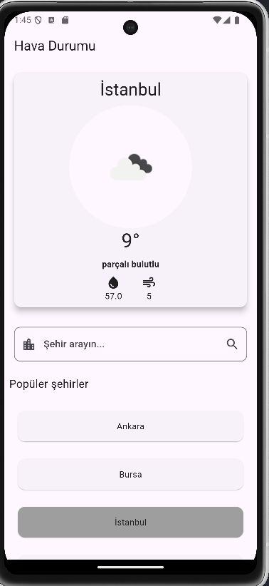
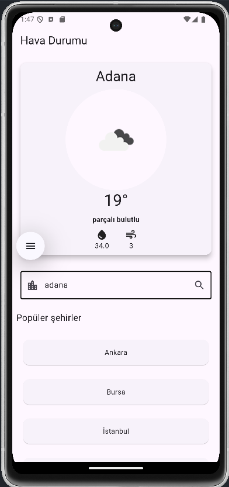
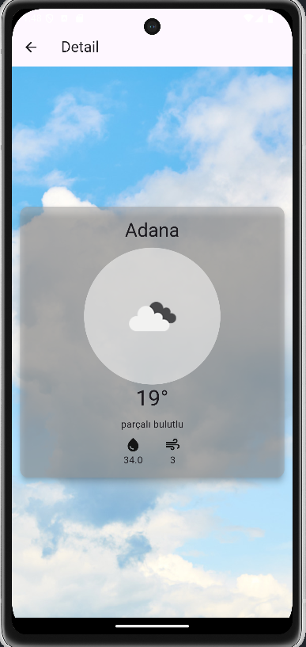

📱 Hava Durumu Uygulaması
Bu uygulama, OpenWeather API'yi kullanarak hava durumu verilerini alır ve kullanıcıya sunar. Uygulama, Dio kütüphanesi ile API çağrıları yapar ve named routes kullanarak ekranlar arasında geçiş yapar. Ayrıca, bir search bar ile kullanıcılar şehirlerini arayarak hava durumu bilgilerini görüntüleyebilirler.

💡 Özellikler
OpenWeather API'yi kullanarak hava durumu verilerini alır.

Dio kütüphanesi ile API çağrıları yapar.

Named routes kullanarak ekranlar arasında geçiş.

TextField widget'ı ile şehir arama işlemi.

Kullanıcı dostu bir arayüz.

⚙️ Teknolojiler
Flutter: Mobil uygulama geliştirme framework'ü.

Dio: HTTP istekleri için kütüphane.

OpenWeather API: Hava durumu verilerini sağlamak için kullanılan API.

Named Routes: Sayfalar arasında geçiş yapma.

TextField: Kullanıcıdan şehir adı almak için.

🖼️ Ekran Görüntüleri
## 🖼️ Ekran Görüntüleri

### Ana Sayfa ve Detay Sayfası

| Ana Sayfa 1 | Ana Sayfa 2 |
|-------------|-------------|
|  |  |

### Detay Sayfası

| Detay Sayfası |
|----------------|
|  |
